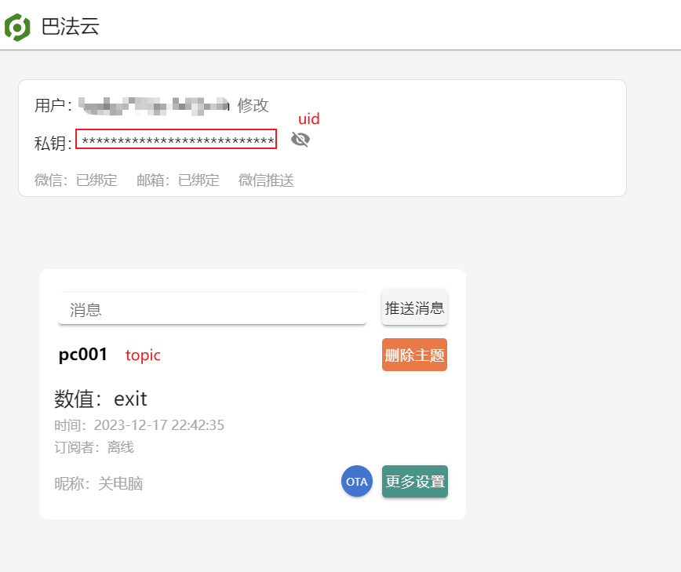
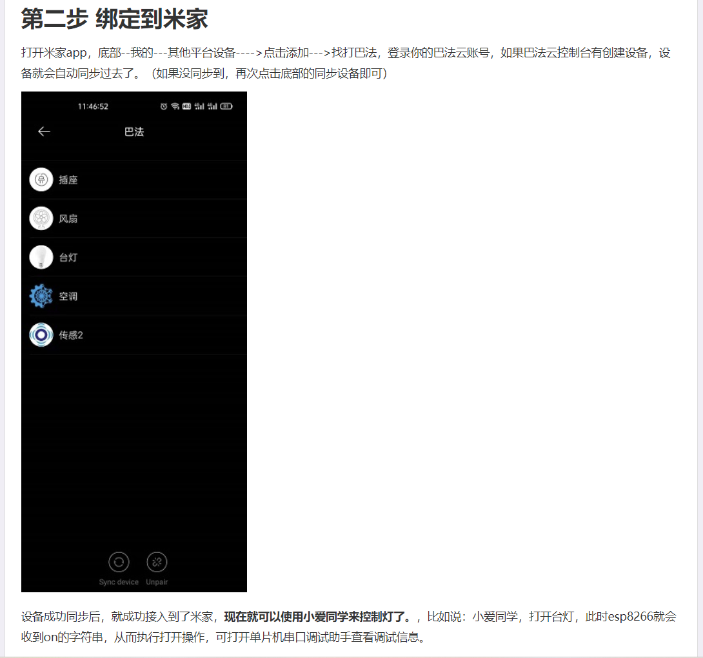

# bemfa Virtual Smart Home Device Setup Guide

This guide provides step-by-step instructions to set up a virtual smart home device (socket) on cloud.bemfa, establish a TCP connection locally and with cloud.bemfa, and connect the device to Xiaomi's Xiao Ai assistant for remote control.

## 1. Registration on Cloud.bemfa

- Visit [bemfa](https://cloud.bemfa.com/) to register your account.
- Once registered, log in to your account.
- Navigate to the device registration section.
- Register a new virtual smart home device (socket) with relevant details.
- Doc: https://cloud.bemfa.com/docs/#/
## 2. Establishing TCP Connection

### Local Connection

- Follow the steps in the previous section to set up a virtual device on cloud.bemfa.
- Retrieve the device UID and topic from the cloud.bemfa portal.
- Update the `config.py` file with the obtained UID and TOPIC.

```python
# config.py

```python
# my example
UID = '087162ad5f2043a8a82aa37d********'
TOPIC = 'pc001'
```


- Run the main script.

```bash
python main.py
```

## 3. Connect with Xiaomi Xiao Ai Assistant

- Make sure your virtual device is successfully registered and the local and cloud connections are established.
- Connect your Xiaomi Xiao Ai assistant to cloud.bemfa using the provided instructions on the Xiaomi app.

- https://www.cnblogs.com/bemfa/p/15218111.html
- Once connected, you should be able to control the virtual device using voice commands through Xiao Ai assistant.

Congratulations! You have successfully set up a virtual smart home device, established local and cloud connections, and integrated it with Xiaomi's Xiao Ai(小爱同学) assistant for remote control.